import { TypeTable } from 'fumadocs-ui/components/type-table';

# Types Reference

This document provides complete type definitions for all objects and interfaces used throughout the Roblox Supabase client. These types enable type-safe database operations and provide full IntelliSense support in Roblox Studio.

## Core Query Types

### `RootQuery`

The entry point for all database operations after selecting a table with `from()`. Provides methods to start SELECT, INSERT, UPDATE, UPSERT, DELETE, and RPC queries.

<TypeTable
    type={{
        select: {
            description: "Specifies which columns to retrieve from the table. Returns a SelectFilterStage object for method chaining.",
            type: 'function(columns: string) -> SelectFilterStage',
            returns: "SelectFilterStage",
            parameters: [
                {
                    name: "columns",
                    type: "string",
                    description: "Comma-separated list of column names. Use '*' for all columns, or 'column1, column2, related_table(*)' for joins."
                }
            ]
        },

        insert: {
            description: "Creates an INSERT query to add new rows. Returns an InsertQuery for method chaining.",
            type: "function(data: {[string]: any}, options: InsertOptions?) -> InsertQuery",
            returns: "InsertQuery",
            parameters: [
                {
                    name: "data",
                    type: "{[string]: any} | {[string]: any}[]",
                    description: "Object or array of objects containing data to insert."
                },
                {
                    name: "options",
                    type: "InsertOptions?",
                    description: "Optional configuration for the insert operation."
                }
            ]
        },

        update: {
            description: "Creates an UPDATE query to modify existing rows. Returns an UpdateFilterStage for method chaining.",
            type: "function(data: {[string]: any}, options: UpdateOptions?) -> UpdateFilterStage",
            returns: "UpdateFilterStage",
            parameters: [
                {
                    name: "data",
                    type: "{[string]: any}",
                    description: "Object containing column-value pairs to update."
                },
                {
                    name: "options",
                    type: "UpdateOptions?",
                    description: "Optional configuration for the update operation."
                }
            ]
        },

        upsert: {
            description: "Creates an UPSERT query (insert or update) to add new rows or update existing ones. Returns an UpsertQuery for method chaining.",
            type: "function(data: {[string]: any}, options: InsertOptions?) -> UpsertQuery",
            returns: "UpsertQuery",
            parameters: [
                {
                    name: "data",
                    type: "{[string]: any} | {[string]: any}[]",
                    description: "Object or array of objects containing data to upsert. Must include primary key or unique constraint columns."
                },
                {
                    name: "options",
                    type: "InsertOptions?",
                    description: "Optional configuration including onConflict, returning, and count preferences."
                }
            ]
        },

        delete: {
            description: "Creates a DELETE query to remove rows. Returns a DeleteFilterStage for method chaining.",
            type: "function(options: DeleteOptions?) -> DeleteFilterStage",
            returns: "DeleteFilterStage",
            parameters: [
                {
                    name: "options",
                    type: "DeleteOptions?",
                    description: "Optional configuration for the delete operation."
                }
            ]
        },

        rpc: {
            description: "Calls a PostgreSQL stored procedure. Returns an RPCFilterStage for method chaining.",
            type: "function(fnName: string, params: {any}?) -> RPCFilterStage",
            returns: "RPCFilterStage",
            parameters: [
                {
                    name: "fnName",
                    type: "string",
                    description: "Name of the PostgreSQL function to call."
                },
                {
                    name: "params",
                    type: "{any}?",
                    description: "Optional parameters to pass to the function."
                }
            ]
        }
    }}
/>

### Query Stages Overview

The new type system uses a stage-based approach where you can chain filters first, then transition to modifiers. Once you use a modifier, you cannot go back to filters in that chain.

### `SelectFilterStage` → `SelectModifierStage`

A query builder for SELECT operations that supports filtering first, then modifiers.

<TypeTable
    type={{
        FilterMethods: {
            description: "All filter methods (eq, neq, gt, etc.) return SelectFilterStage for chaining",
            type: "function(column: string, value: any) -> SelectFilterStage"
        },
        TransitioningModifiers: {
            description: "Modifier methods (order, limit, single, etc.) transition to SelectModifierStage",
            type: "function(...) -> SelectModifierStage"
        },
        BaseExec: {
            description: "Inherits execution methods",
            type: "BaseExec"
        }
    }}
/>

### `SelectModifierStage`

The stage after applying a modifier in a SELECT query. Contains only modifier methods and execution.

<TypeTable
    type={{
        order: {
            description: "Sort results by column(s).",
            type: "function(column: string, options: OrderOptions?) -> SelectModifierStage",
            returns: "SelectModifierStage"
        },
        limit: {
            description: "Limit number of rows returned.",
            type: "function(count: number, options: LimitOptions?) -> SelectModifierStage",
            returns: "SelectModifierStage"
        },
        range: {
            description: "Get specific range of rows for pagination.",
            type: "function(from: number, to: number, options: RangeOptions?) -> SelectModifierStage",
            returns: "SelectModifierStage"
        },
        single: {
            description: "Expect and return exactly one row. Throws error if zero or multiple rows.",
            type: "function() -> SelectModifierStage",
            returns: "SelectModifierStage"
        },
        maybeSingle: {
            description: "Return one row or nil if no rows match.",
            type: "function() -> SelectModifierStage",
            returns: "SelectModifierStage"
        },
        csv: {
            description: "Request CSV format response instead of JSON.",
            type: "function() -> SelectModifierStage",
            returns: "SelectModifierStage"
        },
        returns: {
            description: "Specify return representation preference.",
            type: 'function(representation: "minimal" | "representation") -> SelectModifierStage',
            returns: "SelectModifierStage"
        },
        overrideTypes: {
            description: "Override runtime type validation schema.",
            type: "function(schema: table) -> SelectModifierStage",
            returns: "SelectModifierStage"
        },
        explain: {
            description: "Get query execution plan instead of results.",
            type: "function(options: ExplainOptions?) -> SelectModifierStage",
            returns: "SelectModifierStage"
        },
        BaseExec: {
            description: "Inherits execution methods",
            type: "BaseExec"
        }
    }}
/>

### `InsertQuery` / `UpsertQuery`

Query builders for INSERT and UPSERT operations with only modifier support (no filters).

<TypeTable
    type={{
        select: {
            description: "Specifies which columns to return from the inserted/upserted rows.",
            type: "function(columns: string) -> InsertQuery",
            returns: "InsertQuery"
        },
        returns: {
            description: "Specifies the return representation preference.",
            type: "function(representation: 'minimal' | 'representation') -> InsertQuery",
            returns: "InsertQuery"
        },
        single: {
            description: "Expects and returns exactly one row.",
            type: "function() -> InsertQuery",
            returns: "InsertQuery"
        },
        maybeSingle: {
            description: "Returns one row or nil if none.",
            type: "function() -> InsertQuery",
            returns: "InsertQuery"
        },
        csv: {
            description: "Requests CSV format response.",
            type: "function() -> InsertQuery",
            returns: "InsertQuery"
        },
        BaseExec: {
            description: "Inherits execution methods",
            type: "BaseExec"
        }
    }}
/>

### `UpdateFilterStage` → `UpdateModifierStage`

A query builder for UPDATE operations with filter support first, then mutation modifiers.

<TypeTable
    type={{
        FilterMethods: {
            description: "All filter methods (eq, neq, gt, etc.) return UpdateFilterStage for chaining",
            type: "function(column: string, value: any) -> UpdateFilterStage"
        },
        TransitioningModifiers: {
            description: "Mutation modifier methods (select, returns, single, etc.) transition to UpdateModifierStage",
            type: "function(...) -> UpdateModifierStage"
        },
        BaseExec: {
            description: "Inherits execution methods",
            type: "BaseExec"
        }
    }}
/>

### `UpdateModifierStage`

The stage after applying a mutation modifier in an UPDATE query.

<TypeTable
    type={{
        select: {
            description: "Specifies which columns to return from the updated rows.",
            type: "function(columns: string) -> UpdateModifierStage",
            returns: "UpdateModifierStage"
        },
        returns: {
            description: "Specifies the return representation preference.",
            type: "function(representation: 'minimal' | 'representation') -> UpdateModifierStage",
            returns: "UpdateModifierStage"
        },
        single: {
            description: "Expects and returns exactly one row.",
            type: "function() -> UpdateModifierStage",
            returns: "UpdateModifierStage"
        },
        maybeSingle: {
            description: "Returns one row or nil if none.",
            type: "function() -> UpdateModifierStage",
            returns: "UpdateModifierStage"
        },
        csv: {
            description: "Requests CSV format response.",
            type: "function() -> UpdateModifierStage",
            returns: "UpdateModifierStage"
        },
        BaseExec: {
            description: "Inherits execution methods",
            type: "BaseExec"
        }
    }}
/>

### `DeleteFilterStage` → `DeleteModifierStage`

A query builder for DELETE operations with filter support first, then mutation modifiers.

<TypeTable
    type={{
        FilterMethods: {
            description: "All filter methods (eq, neq, gt, etc.) return DeleteFilterStage for chaining",
            type: "function(column: string, value: any) -> DeleteFilterStage"
        },
        TransitioningModifiers: {
            description: "Mutation modifier methods (select, returns, single, etc.) transition to DeleteModifierStage",
            type: "function(...) -> DeleteModifierStage"
        },
        BaseExec: {
            description: "Inherits execution methods",
            type: "BaseExec"
        }
    }}
/>

### `RPCFilterStage` → `RPCModifierStage`

A query builder for calling PostgreSQL stored procedures with filter and modifier support.

<TypeTable
    type={{
        FilterMethods: {
            description: "All filter methods (eq, neq, gt, etc.) return RPCFilterStage for chaining",
            type: "function(column: string, value: any) -> RPCFilterStage"
        },
        TransitioningModifiers: {
            description: "Modifier methods (order, limit, single, etc.) transition to RPCModifierStage",
            type: "function(...) -> RPCModifierStage"
        },
        get: {
            description: "Uses GET method instead of POST for the RPC call. Useful for immutable functions.",
            type: "function() -> RPCFilterStage",
            returns: "RPCFilterStage"
        },
        BaseExec: {
            description: "Inherits execution methods",
            type: "BaseExec"
        }
    }}
/>

## Base Types

### `BaseExec`

Base interface containing execution methods common to all query types.

<TypeTable
    type={{
        execute: {
            description: "Execute the query and return results or error.",
            type: "function() -> (any, string?)",
            returns: "(any, string?)"
        },
        executeTyped: {
            description: "Execute with runtime type validation.",
            type: "function() -> (any, string?)",
            returns: "(any, string?)"
        }
    }}
/>

### `FilterStage<Next>`

Generic filter stage type used internally. All filter methods return the `Next` type parameter.

### `ModifierFinal`

Full modifier stage used by SELECT and RPC queries after transitioning from filter stage.

### `MutationModifierFinal`

Mutation modifier stage used by INSERT, UPDATE, DELETE, and UPSERT queries after transitioning.

## Configuration Types

### `InsertOptions`

Configuration options for INSERT and UPSERT operations.

<TypeTable
    type={{
        returning: {
            description: "Return preference: minimal returns boolean, representation returns data.",
            type: '"minimal" | "representation"?'
        },
        count: {
            description: "Count preference for affected rows.",
            type: '"exact" | "planned" | "estimated"?'
        },
        defaultToNull: {
            description: "Use NULL for missing columns instead of defaults.",
            type: "boolean?"
        },
        onConflict: {
            description: "Columns to check for conflicts (for upsert).",
            type: "string?"
        },
        ignoreDuplicates: {
            description: "Ignore duplicate rows instead of updating.",
            type: "boolean?"
        },
        upsert: {
            description: "Perform upsert operation (insert or update).",
            type: "boolean?"
        }
    }}
/>

### `UpdateOptions`

Configuration options for UPDATE operations.

<TypeTable
    type={{
        returning: {
            description: "Return preference for updated rows.",
            type: '"minimal" | "representation"?'
        },
        count: {
            description: "Count preference for affected rows.",
            type: '"exact" | "planned" | "estimated"?'
        }
    }}
/>

### `DeleteOptions`

Configuration options for DELETE operations.

<TypeTable
    type={{
        returning: {
            description: "Return preference for deleted rows.",
            type: '"minimal" | "representation"?'
        },
        count: {
            description: "Count preference for affected rows.",
            type: '"exact" | "planned" | "estimated"?'
        }
    }}
/>

### `OrderOptions`

Configuration options for ordering operations.

<TypeTable
    type={{
        ascending: {
            description: "Sort in ascending order (default: true).",
            type: "boolean?"
        },
        nullsFirst: {
            description: "Put NULL values first (default: false).",
            type: "boolean?"
        },
        foreignTable: {
            description: "Order by foreign table column.",
            type: "string?"
        },
        referencedTable: {
            description: "Order by referenced table.",
            type: "string?"
        }
    }}
/>

### `LimitOptions`

Configuration options for limit operations.

<TypeTable
    type={{
        foreignTable: {
            description: "Apply limit to foreign table results.",
            type: "string?"
        },
        referencedTable: {
            description: "Apply limit to referenced table results.",
            type: "string?"
        }
    }}
/>

### `RangeOptions`

Configuration options for range operations.

<TypeTable
    type={{
        foreignTable: {
            description: "Apply range to foreign table results.",
            type: "string?"
        },
        referencedTable: {
            description: "Apply range to referenced table results.",
            type: "string?"
        }
    }}
/>

### `OrFilterOptions`

Configuration options for OR filter operations.

<TypeTable
    type={{
        foreignTable: {
            description: "Apply OR filter to foreign table.",
            type: "string?"
        }
    }}
/>

### `ExplainOptions`

Configuration options for query execution plan explanation.

<TypeTable
    type={{
        analyze: {
            description: "Include actual run times and row counts.",
            type: "boolean?"
        },
        verbose: {
            description: "Include additional planning information.",
            type: "boolean?"
        },
        settings: {
            description: "Include configuration settings.",
            type: "boolean?"
        },
        buffers: {
            description: "Include buffer usage information.",
            type: "boolean?"
        },
        wal: {
            description: "Include Write-Ahead Log usage.",
            type: "boolean?"
        },
        format: {
            description: "Output format for explain results.",
            type: '"text" | "json" | "yaml"?'
        }
    }}
/>

## Service Client Types

### `RestClient`

Main REST API client interface for Supabase PostgREST operations.

<TypeTable
    type={{
        from: {
            description: "Select a table to query.",
            type: "function(tableName: string) -> RootQuery",
            returns: "RootQuery"
        }
    }}
/>

### `SupabaseClient`

The main client type returned by `Supabase.createClient()`. Provides access to all services.

<TypeTable
    type={{
        rest: {
            description: "REST API client for database operations.",
            type: "Rest.RestClient"
        },
        storage: {
            description: "Storage client for file operations.",
            type: "Storage.StorageClient"
        },
        functions: {
            description: "Edge Functions client.",
            type: "EdgeFunctions.FunctionsClient"
        },
        _unitTests: {
            description: "Internal unit testing module.",
            type: "UnitTests.UnitTests"
        },
        from: {
            description: "Proxy to rest:from() for table queries.",
            type: "function(tableName: string) -> RootQuery",
            returns: "RootQuery"
        },
        rpc: {
            description: "Proxy to rest:rpc() for function calls.",
            type: "function(functionName: string, params: {[string]: any}?) -> RPCFilterStage",
            returns: "RPCFilterStage"
        }
    }}
/>

## Type Relationships

### Stage-Based Flow Diagram

```mermaid
graph TD
    A[RootQuery] --> B[select]
    A --> C[insert/upsert]
    A --> D[update]
    A --> E[delete]
    A --> F[rpc]

    B --> G[SelectFilterStage]
    C --> H[InsertQuery/UpsertQuery]
    D --> I[UpdateFilterStage]
    E --> J[DeleteFilterStage]
    F --> K[RPCFilterStage]

    G -->|filters| G
    G -->|modifiers| L[SelectModifierStage]

    I -->|filters| I
    I -->|modifiers| M[UpdateModifierStage]

    J -->|filters| J
    J -->|modifiers| N[DeleteModifierStage]

    K -->|filters| K
    K -->|modifiers| O[RPCModifierStage]

    L -->|modifiers| L
    M -->|modifiers| M
    N -->|modifiers| N
    O -->|modifiers| O

    style A fill:#11181c
    style G fill:#34b27b
    style I fill:#34b27b
    style J fill:#34b27b
    style K fill:#34b27b
    style L fill:#0066cc
    style M fill:#0066cc
    style N fill:#0066cc
    style O fill:#0066cc
```

### Method Availability by Query Stage
|Method Type|Filter Stage|Modifier Stage|Mutation Modifier Stage|
|--|--|--|--|
|**Filter Methods** (eq, neq, gt, etc.)|✅ Chainable (returns same stage)|❌ Not available|❌ Not available|
|**Transitioning Modifiers** (order, limit, single, etc.)|✅ Available (transitions to ModifierStage)|✅ Chainable (returns ModifierStage)|Varies by query type|
|**Mutation Modifiers** (select, returns, single, etc.)|✅ For UPDATE/DELETE (transitions to MutationModifierStage)|❌ Not applicable|✅ Chainable (returns MutationModifierStage)|
|**Execution Methods** (execute, executeTyped)|✅ Available|✅ Available|✅ Available|

## Query Type to Stage Mapping

|Query Type|Initial Stage|After First Modifier|
|--|--|--|
|`select()`|	`SelectFilterStage`|	`SelectModifierStage`|
|`update()`|	`UpdateFilterStage`|	`UpdateModifierStage`|
|`delete()`|	`DeleteFilterStage`|	`DeleteModifierStage`|
|`rpc()`|	`RPCFilterStage`|	`RPCModifierStage`|
|`insert()`/`upsert()`|	`InsertQuery`/`UpsertQuery` (no filter stage)|Same (MutationModifierFinal)|