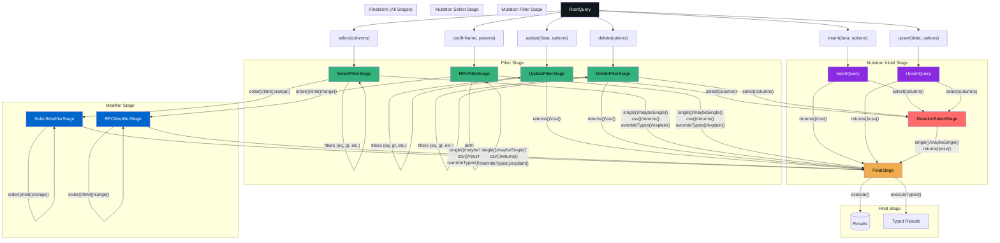

import { TypeTable } from 'fumadocs-ui/components/type-table';

# Types Reference

This document provides complete type definitions for all objects and interfaces used throughout the Roblox Supabase client. These types enable type-safe database operations and provide full IntelliSense support in Roblox Studio.

## Core Query Types

### `RootQuery`

The entry point for all database operations after selecting a table with `from()`. Provides methods to start SELECT, INSERT, UPDATE, UPSERT, DELETE, and RPC queries.

<TypeTable
    type={{
        select: {
            description: "Specifies which columns to retrieve from the table. Returns a SelectFilterStage object for method chaining.",
            type: 'function(columns: string) -> SelectFilterStage',
            returns: "SelectFilterStage",
            parameters: [
                {
                    name: "columns",
                    type: "string",
                    description: "Comma-separated list of column names. Use '*' for all columns, or 'column1, column2, related_table(*)' for joins."
                }
            ]
        },

        insert: {
            description: "Creates an INSERT query to add new rows. Returns an InsertQuery for method chaining.",
            type: "function(data: {[string]: any}, options: InsertOptions?) -> InsertQuery",
            returns: "InsertQuery",
            parameters: [
                {
                    name: "data",
                    type: "{[string]: any} | {[string]: any}[]",
                    description: "Object or array of objects containing data to insert."
                },
                {
                    name: "options",
                    type: "InsertOptions?",
                    description: "Optional configuration for the insert operation."
                }
            ]
        },

        update: {
            description: "Creates an UPDATE query to modify existing rows. Returns an UpdateFilterStage for method chaining.",
            type: "function(data: {[string]: any}, options: UpdateOptions?) -> UpdateFilterStage",
            returns: "UpdateFilterStage",
            parameters: [
                {
                    name: "data",
                    type: "{[string]: any}",
                    description: "Object containing column-value pairs to update."
                },
                {
                    name: "options",
                    type: "UpdateOptions?",
                    description: "Optional configuration for the update operation."
                }
            ]
        },

        upsert: {
            description: "Creates an UPSERT query (insert or update) to add new rows or update existing ones. Returns an UpsertQuery for method chaining.",
            type: "function(data: {[string]: any}, options: InsertOptions?) -> UpsertQuery",
            returns: "UpsertQuery",
            parameters: [
                {
                    name: "data",
                    type: "{[string]: any} | {[string]: any}[]",
                    description: "Object or array of objects containing data to upsert. Must include primary key or unique constraint columns."
                },
                {
                    name: "options",
                    type: "InsertOptions?",
                    description: "Optional configuration including onConflict, returning, and count preferences."
                }
            ]
        },

        delete: {
            description: "Creates a DELETE query to remove rows. Returns a DeleteFilterStage for method chaining.",
            type: "function(options: DeleteOptions?) -> DeleteFilterStage",
            returns: "DeleteFilterStage",
            parameters: [
                {
                    name: "options",
                    type: "DeleteOptions?",
                    description: "Optional configuration for the delete operation."
                }
            ]
        },

        rpc: {
            description: "Calls a PostgreSQL stored procedure. Returns an RPCFilterStage for method chaining.",
            type: "function(fnName: string, params: {any}?) -> RPCFilterStage",
            returns: "RPCFilterStage",
            parameters: [
                {
                    name: "fnName",
                    type: "string",
                    description: "Name of the PostgreSQL function to call."
                },
                {
                    name: "params",
                    type: "{any}?",
                    description: "Optional parameters to pass to the function."
                }
            ]
        }
    }}
/>

## Query Stage System

The type system uses a sophisticated stage-based approach with finalizer collapsing. Understanding these stages is key to using the API effectively:

### Stage Flow Overview

1. **Filter Stage**: Initial stage for SELECT, UPDATE, DELETE, and RPC queries where filter methods are chainable
2. **Modifier Stage**: For SELECT/RPC after using non-final modifiers (`order`, `limit`, `range`)
3. **Mutation Stages**: Special stages for INSERT, UPDATE, DELETE operations
4. **Final Stage**: Collapsed stage with only execution methods after using finalizers

### Key Concepts

- **Chainable Methods**: Return the same stage type for further chaining
- **Transitioning Methods**: Move to a different stage type
- **Finalizers**: Collapse the chain to `FinalStage` with only `execute()`/`executeTyped()`
- **Non-Final Modifiers**: Remain in modifier stage for further chaining

## SELECT Query Types

### `SelectFilterStage`

The initial stage for SELECT queries. Filter methods are chainable, while modifiers transition to `SelectModifierStage` or collapse to `FinalStage`.

<TypeTable
    type={{
        FilterMethods: {
            description: "All filter methods (eq, neq, gt, etc.) return SelectFilterStage for unlimited chaining",
            type: "FilterStage<SelectFilterStage>",
            note: "Includes eq, neq, gt, gte, lt, lte, like, ilike, is, in_, contains, containedBy, rangeGt, rangeGte, rangeLt, rangeLte, rangeAdjacent, overlaps, match, not_, filter, or_"
        },
        order: {
            description: "Sort results by column(s). Transitions to SelectModifierStage.",
            type: "function(column: string, options: OrderOptions?) -> SelectModifierStage",
            returns: "SelectModifierStage"
        },
        limit: {
            description: "Limit number of rows returned. Transitions to SelectModifierStage.",
            type: "function(count: number, options: LimitOptions?) -> SelectModifierStage",
            returns: "SelectModifierStage"
        },
        range: {
            description: "Get specific range of rows for pagination. Transitions to SelectModifierStage.",
            type: "function(from: number, to: number, options: RangeOptions?) -> SelectModifierStage",
            returns: "SelectModifierStage"
        },
        single: {
            description: "Expect exactly one row. Finalizer that collapses to FinalStage.",
            type: "function() -> FinalStage",
            returns: "FinalStage"
        },
        maybeSingle: {
            description: "Return one row or nil if none. Finalizer that collapses to FinalStage.",
            type: "function() -> FinalStage",
            returns: "FinalStage"
        },
        csv: {
            description: "Request CSV format response. Finalizer that collapses to FinalStage.",
            type: "function() -> FinalStage",
            returns: "FinalStage"
        },
        returns: {
            description: "Specify return representation preference. Finalizer that collapses to FinalStage.",
            type: 'function(representation: "minimal" | "representation") -> FinalStage',
            returns: "FinalStage"
        },
        overrideTypes: {
            description: "Override runtime type validation schema. Finalizer that collapses to FinalStage.",
            type: "function(schema: table) -> FinalStage",
            returns: "FinalStage"
        },
        explain: {
            description: "Get query execution plan. Finalizer that collapses to FinalStage.",
            type: "function(options: ExplainOptions?) -> FinalStage",
            returns: "FinalStage"
        },
        BaseExec: {
            description: "Inherits execution methods for immediate execution",
            type: "BaseExec"
        }
    }}
/>

### `SelectModifierStage`

The stage after applying non-final modifiers (`order`, `limit`, `range`) in a SELECT query.

<TypeTable
    type={{
        order: {
            description: "Sort results by column(s). Chainable within modifier stage.",
            type: "function(column: string, options: OrderOptions?) -> SelectModifierStage",
            returns: "SelectModifierStage"
        },
        limit: {
            description: "Limit number of rows returned. Chainable within modifier stage.",
            type: "function(count: number, options: LimitOptions?) -> SelectModifierStage",
            returns: "SelectModifierStage"
        },
        range: {
            description: "Get specific range of rows. Chainable within modifier stage.",
            type: "function(from: number, to: number, options: RangeOptions?) -> SelectModifierStage",
            returns: "SelectModifierStage"
        },
        single: {
            description: "Expect exactly one row. Finalizer that collapses to FinalStage.",
            type: "function() -> FinalStage",
            returns: "FinalStage"
        },
        maybeSingle: {
            description: "Return one row or nil if none. Finalizer that collapses to FinalStage.",
            type: "function() -> FinalStage",
            returns: "FinalStage"
        },
        csv: {
            description: "Request CSV format response. Finalizer that collapses to FinalStage.",
            type: "function() -> FinalStage",
            returns: "FinalStage"
        },
        returns: {
            description: "Specify return representation. Finalizer that collapses to FinalStage.",
            type: 'function(representation: "minimal" | "representation") -> FinalStage',
            returns: "FinalStage"
        },
        overrideTypes: {
            description: "Override type validation schema. Finalizer that collapses to FinalStage.",
            type: "function(schema: table) -> FinalStage",
            returns: "FinalStage"
        },
        explain: {
            description: "Get query execution plan. Finalizer that collapses to FinalStage.",
            type: "function(options: ExplainOptions?) -> FinalStage",
            returns: "FinalStage"
        },
        BaseExec: {
            description: "Inherits execution methods",
            type: "BaseExec"
        }
    }}
/>

## Mutation Query Types (INSERT/UPSERT)

### `InsertQuery` / `UpsertQuery`

Initial stage for INSERT and UPSERT operations. These start in `MutationInitialStage` with no filter support.

<TypeTable
    type={{
        select: {
            description: "Specifies which columns to return. Transitions to MutationSelectStage.",
            type: "function(columns: string) -> MutationSelectStage",
            returns: "MutationSelectStage"
        },
        returns: {
            description: "Specifies return representation preference. Finalizer that collapses to FinalStage.",
            type: 'function(representation: "minimal" | "representation") -> FinalStage',
            returns: "FinalStage"
        },
        csv: {
            description: "Requests CSV format response. Finalizer that collapses to FinalStage.",
            type: "function() -> FinalStage",
            returns: "FinalStage"
        },
        BaseExec: {
            description: "Inherits execution methods for immediate execution",
            type: "BaseExec"
        }
    }}
/>

## Mutation Query Types (UPDATE/DELETE)

### `UpdateFilterStage`

Initial stage for UPDATE operations with filter support.

<TypeTable
    type={{
        FilterMethods: {
            description: "All filter methods (eq, neq, gt, etc.) return UpdateFilterStage for unlimited chaining",
            type: "FilterStage<UpdateFilterStage>",
            note: "Includes all filter methods from FilterStage"
        },
        select: {
            description: "Specifies which columns to return. Transitions to MutationSelectStage.",
            type: "function(columns: string) -> MutationSelectStage",
            returns: "MutationSelectStage"
        },
        returns: {
            description: "Specifies return representation preference. Finalizer that collapses to FinalStage.",
            type: 'function(representation: "minimal" | "representation") -> FinalStage',
            returns: "FinalStage"
        },
        csv: {
            description: "Requests CSV format response. Finalizer that collapses to FinalStage.",
            type: "function() -> FinalStage",
            returns: "FinalStage"
        },
        BaseExec: {
            description: "Inherits execution methods for immediate execution",
            type: "BaseExec"
        }
    }}
/>

### `DeleteFilterStage`

Initial stage for DELETE operations with filter support.

<TypeTable
    type={{
        FilterMethods: {
            description: "All filter methods (eq, neq, gt, etc.) return DeleteFilterStage for unlimited chaining",
            type: "FilterStage<DeleteFilterStage>",
            note: "Includes all filter methods from FilterStage"
        },
        select: {
            description: "Specifies which columns to return. Transitions to MutationSelectStage.",
            type: "function(columns: string) -> MutationSelectStage",
            returns: "MutationSelectStage"
        },
        returns: {
            description: "Specifies return representation preference. Finalizer that collapses to FinalStage.",
            type: 'function(representation: "minimal" | "representation") -> FinalStage',
            returns: "FinalStage"
        },
        csv: {
            description: "Requests CSV format response. Finalizer that collapses to FinalStage.",
            type: "function() -> FinalStage",
            returns: "FinalStage"
        },
        BaseExec: {
            description: "Inherits execution methods for immediate execution",
            type: "BaseExec"
        }
    }}
/>

## RPC Query Types

### `RPCFilterStage`

Initial stage for calling PostgreSQL stored procedures with filter support.

<TypeTable
    type={{
        FilterMethods: {
            description: "All filter methods (eq, neq, gt, etc.) return RPCFilterStage for unlimited chaining",
            type: "FilterStage<RPCFilterStage>",
            note: "Includes all filter methods from FilterStage"
        },
        order: {
            description: "Sort results by column(s). Transitions to RPCModifierStage.",
            type: "function(column: string, options: OrderOptions?) -> RPCModifierStage",
            returns: "RPCModifierStage"
        },
        limit: {
            description: "Limit number of rows returned. Transitions to RPCModifierStage.",
            type: "function(count: number, options: LimitOptions?) -> RPCModifierStage",
            returns: "RPCModifierStage"
        },
        range: {
            description: "Get specific range of rows. Transitions to RPCModifierStage.",
            type: "function(from: number, to: number, options: RangeOptions?) -> RPCModifierStage",
            returns: "RPCModifierStage"
        },
        single: {
            description: "Expect exactly one row. Finalizer that collapses to FinalStage.",
            type: "function() -> FinalStage",
            returns: "FinalStage"
        },
        maybeSingle: {
            description: "Return one row or nil if none. Finalizer that collapses to FinalStage.",
            type: "function() -> FinalStage",
            returns: "FinalStage"
        },
        csv: {
            description: "Request CSV format response. Finalizer that collapses to FinalStage.",
            type: "function() -> FinalStage",
            returns: "FinalStage"
        },
        returns: {
            description: "Specify return representation. Finalizer that collapses to FinalStage.",
            type: 'function(representation: "minimal" | "representation") -> FinalStage',
            returns: "FinalStage"
        },
        overrideTypes: {
            description: "Override type validation schema. Finalizer that collapses to FinalStage.",
            type: "function(schema: table) -> FinalStage",
            returns: "FinalStage"
        },
        explain: {
            description: "Get query execution plan. Finalizer that collapses to FinalStage.",
            type: "function(options: ExplainOptions?) -> FinalStage",
            returns: "FinalStage"
        },
        get: {
            description: "Uses GET method instead of POST for immutable functions. Chainable in filter stage.",
            type: "function() -> RPCFilterStage",
            returns: "RPCFilterStage"
        },
        BaseExec: {
            description: "Inherits execution methods for immediate execution",
            type: "BaseExec"
        }
    }}
/>

### `RPCModifierStage`

The stage after applying non-final modifiers (`order`, `limit`, `range`) in an RPC query.

<TypeTable
    type={{
        order: {
            description: "Sort results by column(s). Chainable within modifier stage.",
            type: "function(column: string, options: OrderOptions?) -> RPCModifierStage",
            returns: "RPCModifierStage"
        },
        limit: {
            description: "Limit number of rows returned. Chainable within modifier stage.",
            type: "function(count: number, options: LimitOptions?) -> RPCModifierStage",
            returns: "RPCModifierStage"
        },
        range: {
            description: "Get specific range of rows. Chainable within modifier stage.",
            type: "function(from: number, to: number, options: RangeOptions?) -> RPCModifierStage",
            returns: "RPCModifierStage"
        },
        single: {
            description: "Expect exactly one row. Finalizer that collapses to FinalStage.",
            type: "function() -> FinalStage",
            returns: "FinalStage"
        },
        maybeSingle: {
            description: "Return one row or nil if none. Finalizer that collapses to FinalStage.",
            type: "function() -> FinalStage",
            returns: "FinalStage"
        },
        csv: {
            description: "Request CSV format response. Finalizer that collapses to FinalStage.",
            type: "function() -> FinalStage",
            returns: "FinalStage"
        },
        returns: {
            description: "Specify return representation. Finalizer that collapses to FinalStage.",
            type: 'function(representation: "minimal" | "representation") -> FinalStage',
            returns: "FinalStage"
        },
        overrideTypes: {
            description: "Override type validation schema. Finalizer that collapses to FinalStage.",
            type: "function(schema: table) -> FinalStage",
            returns: "FinalStage"
        },
        explain: {
            description: "Get query execution plan. Finalizer that collapses to FinalStage.",
            type: "function(options: ExplainOptions?) -> FinalStage",
            returns: "FinalStage"
        },
        BaseExec: {
            description: "Inherits execution methods",
            type: "BaseExec"
        }
    }}
/>

## Mutation Select Stage

### `MutationSelectStage`

The stage after calling `.select()` on a mutation query (INSERT, UPDATE, DELETE, UPSERT). This stage exposes `single` and `maybeSingle` which are not available in `MutationInitialStage`.

<TypeTable
    type={{
        single: {
            description: "Expect exactly one row. Finalizer that collapses to FinalStage.",
            type: "function() -> FinalStage",
            returns: "FinalStage"
        },
        maybeSingle: {
            description: "Return one row or nil if none. Finalizer that collapses to FinalStage.",
            type: "function() -> FinalStage",
            returns: "FinalStage"
        },
        returns: {
            description: "Specify return representation. Finalizer that collapses to FinalStage.",
            type: 'function(representation: "minimal" | "representation") -> FinalStage',
            returns: "FinalStage"
        },
        csv: {
            description: "Request CSV format response. Finalizer that collapses to FinalStage.",
            type: "function() -> FinalStage",
            returns: "FinalStage"
        },
        BaseExec: {
            description: "Inherits execution methods",
            type: "BaseExec"
        }
    }}
/>

## Base Types

### `BaseExec`

Base interface containing execution methods common to all query stages.

<TypeTable
    type={{
        execute: {
            description: "Execute the query and return results or error.",
            type: "function() -> (any, string?)",
            returns: "(any, string?)",
            note: "Available in all stages for immediate execution"
        },
        executeTyped: {
            description: "Execute with runtime type validation.",
            type: "function() -> (any, string?)",
            returns: "(any, string?)",
            note: "Available in all stages for immediate execution"
        }
    }}
/>

### `FilterStage<Next>`

Generic filter stage type used internally. All filter methods return the `Next` type parameter, enabling type-safe chaining.

### `ModifierStage`

Modifier stage for SELECT/RPC queries with non-final modifiers (`order`, `limit`, `range`) that remain chainable, and finalizers that collapse to `FinalStage`.

### `MutationInitialStage`

Initial stage for mutation queries (INSERT/UPSERT) before calling `.select()`. Exposes `returns` and `csv` as finalizers, and `.select()` to transition to `MutationSelectStage`.

### `FinalStage`

Final collapsed stage with only execution methods. Reached after calling any finalizer method (`single`, `maybeSingle`, `csv`, `returns`, `overrideTypes`, `explain`).

<TypeTable
    type={{
        execute: {
            description: "Execute the query and return results or error.",
            type: "function() -> (any, string?)",
            returns: "(any, string?)"
        },
        executeTyped: {
            description: "Execute with runtime type validation.",
            type: "function() -> (any, string?)",
            returns: "(any, string?)"
        }
    }}
/>

## Configuration Types

### `InsertOptions`

Configuration options for INSERT and UPSERT operations.

<TypeTable
    type={{
        returning: {
            description: "Return preference: minimal returns boolean, representation returns data.",
            type: '"minimal" | "representation"?'
        },
        count: {
            description: "Count preference for affected rows.",
            type: '"exact" | "planned" | "estimated"?'
        },
        defaultToNull: {
            description: "Use NULL for missing columns instead of defaults.",
            type: "boolean?"
        },
        onConflict: {
            description: "Columns to check for conflicts (for upsert).",
            type: "string?"
        },
        ignoreDuplicates: {
            description: "Ignore duplicate rows instead of updating.",
            type: "boolean?"
        },
        upsert: {
            description: "Perform upsert operation (insert or update).",
            type: "boolean?"
        }
    }}
/>

### `UpdateOptions`

Configuration options for UPDATE operations.

<TypeTable
    type={{
        returning: {
            description: "Return preference for updated rows.",
            type: '"minimal" | "representation"?'
        },
        count: {
            description: "Count preference for affected rows.",
            type: '"exact" | "planned" | "estimated"?'
        }
    }}
/>

### `DeleteOptions`

Configuration options for DELETE operations.

<TypeTable
    type={{
        returning: {
            description: "Return preference for deleted rows.",
            type: '"minimal" | "representation"?'
        },
        count: {
            description: "Count preference for affected rows.",
            type: '"exact" | "planned" | "estimated"?'
        }
    }}
/>

### `OrderOptions`

Configuration options for ordering operations.

<TypeTable
    type={{
        ascending: {
            description: "Sort in ascending order (default: true).",
            type: "boolean?"
        },
        nullsFirst: {
            description: "Put NULL values first (default: false).",
            type: "boolean?"
        },
        foreignTable: {
            description: "Order by foreign table column.",
            type: "string?"
        },
        referencedTable: {
            description: "Order by referenced table.",
            type: "string?"
        }
    }}
/>

### `LimitOptions`

Configuration options for limit operations.

<TypeTable
    type={{
        foreignTable: {
            description: "Apply limit to foreign table results.",
            type: "string?"
        },
        referencedTable: {
            description: "Apply limit to referenced table results.",
            type: "string?"
        }
    }}
/>

### `RangeOptions`

Configuration options for range operations.

<TypeTable
    type={{
        foreignTable: {
            description: "Apply range to foreign table results.",
            type: "string?"
        },
        referencedTable: {
            description: "Apply range to referenced table results.",
            type: "string?"
        }
    }}
/>

### `OrFilterOptions`

Configuration options for OR filter operations.

<TypeTable
    type={{
        foreignTable: {
            description: "Apply OR filter to foreign table.",
            type: "string?"
        }
    }}
/>

### `ExplainOptions`

Configuration options for query execution plan explanation.

<TypeTable
    type={{
        analyze: {
            description: "Include actual run times and row counts.",
            type: "boolean?"
        },
        verbose: {
            description: "Include additional planning information.",
            type: "boolean?"
        },
        settings: {
            description: "Include configuration settings.",
            type: "boolean?"
        },
        buffers: {
            description: "Include buffer usage information.",
            type: "boolean?"
        },
        wal: {
            description: "Include Write-Ahead Log usage.",
            type: "boolean?"
        },
        format: {
            description: "Output format for explain results.",
            type: '"text" | "json" | "yaml"?'
        }
    }}
/>

## Service Client Types

### `RestClient`

Main REST API client interface for Supabase PostgREST operations.

<TypeTable
    type={{
        from: {
            description: "Select a table to query.",
            type: "function(tableName: string) -> RootQuery",
            returns: "RootQuery"
        }
    }}
/>

### `SupabaseClient`

The main client type returned by `Supabase.createClient()`. Provides access to all services.

<TypeTable
    type={{
        rest: {
            description: "REST API client for database operations.",
            type: "Rest.RestClient"
        },
        storage: {
            description: "Storage client for file operations.",
            type: "Storage.StorageClient"
        },
        functions: {
            description: "Edge Functions client.",
            type: "EdgeFunctions.FunctionsClient"
        },
        _unitTests: {
            description: "Internal unit testing module.",
            type: "UnitTests.UnitTests"
        },
        from: {
            description: "Proxy to rest:from() for table queries.",
            type: "function(tableName: string) -> RootQuery",
            returns: "RootQuery"
        },
        rpc: {
            description: "Proxy to rest:rpc() for function calls.",
            type: "function(functionName: string, params: {[string]: any}?) -> RPCFilterStage",
            returns: "RPCFilterStage"
        }
    }}
/>

## Type Relationships

### Stage-Based Flow Diagram

### Method Availability Matrix

| Method Type | Filter Stage | Modifier Stage | Mutation Initial | Mutation Select | Final Stage |
|-------------|--------------|----------------|------------------|-----------------|-------------|
| **Filter Methods** (eq, neq, gt, etc.) | ✅ Chainable | ❌ Not available | ❌ Not available | ❌ Not available | ❌ Not available |
| **Non-Final Modifiers** (order, limit, range) | ✅ Transitioning | ✅ Chainable | ❌ Not available | ❌ Not available | ❌ Not available |
| **Finalizers** (single, maybeSingle) | ✅ Collapses | ✅ Collapses | ❌ Not available* | ✅ Collapses | ❌ Not available |
| **Finalizers** (csv, returns) | ✅ Collapses | ✅ Collapses | ✅ Collapses | ✅ Collapses | ❌ Not available |
| **Finalizers** (overrideTypes, explain) | ✅ Collapses | ✅ Collapses | ❌ Not available | ❌ Not available | ❌ Not available |
| **select()** | ✅ (Mutation only) | ❌ Not available | ✅ Transitioning | ❌ Not available | ❌ Not available |
| **get()** | ✅ (RPC only) | ❌ Not available | ❌ Not available | ❌ Not available | ❌ Not available |
| **execute()** **executeTyped()** | ✅ Available | ✅ Available | ✅ Available | ✅ Available | ✅ Only these |

*Note: `single()` and `maybeSingle()` are only available in `MutationSelectStage`, not `MutationInitialStage`.*

### Query Type to Stage Mapping

| Query Type | Initial Stage | After `.select()` | After Modifier | After Finalizer |
|------------|---------------|-------------------|----------------|-----------------|
| `select()` | `SelectFilterStage` | N/A | `SelectModifierStage` | `FinalStage` |
| `insert()` | `InsertQuery` (MutationInitialStage) | `MutationSelectStage` | N/A | `FinalStage` |
| `update()` | `UpdateFilterStage` | `MutationSelectStage` | N/A | `FinalStage` |
| `delete()` | `DeleteFilterStage` | `MutationSelectStage` | N/A | `FinalStage` |
| `upsert()` | `UpsertQuery` (MutationInitialStage) | `MutationSelectStage` | N/A | `FinalStage` |
| `rpc()` | `RPCFilterStage` | N/A | `RPCModifierStage` | `FinalStage` |